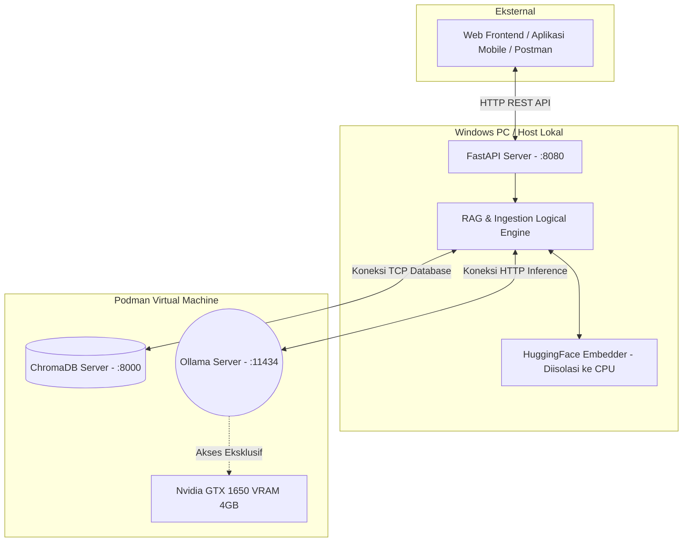
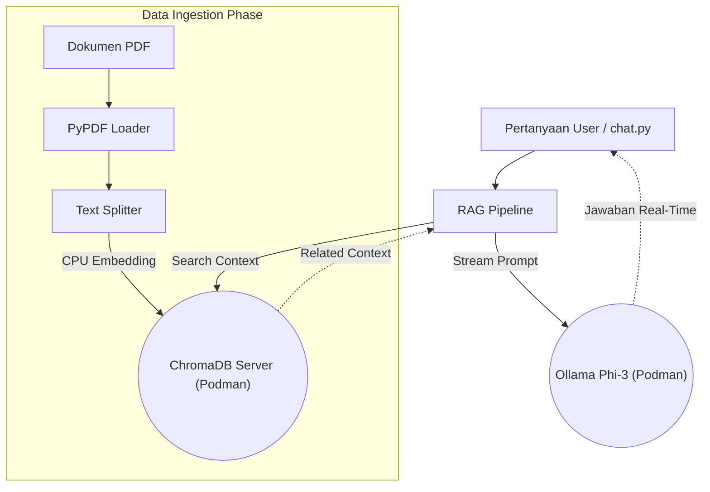
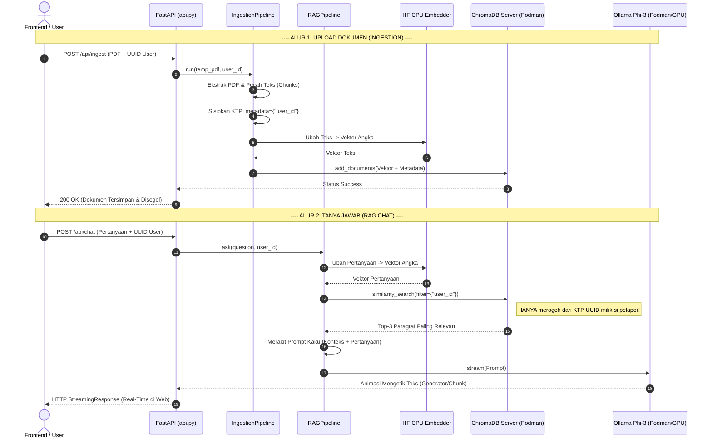

# Mikonku.ai: Local RAG Pipeline

Proyek ini adalah implementasi *Retrieval-Augmented Generation* (RAG) secara **100% Lokal** dan sepenuhnya *Offline* yang mengadopsi standar **Clean Architecture** (Prinsip SOLID). Dibangun untuk mengekstrak, menyimpan, dan membicarakan dokumen (seperti PDF) secara cerdas menggunakan LLM pribadi.

---

## 💻 Spesifikasi Hardware (Target Constraint)
Arsitektur proyek ini didesain secara khusus dan *highly-optimized* untuk mesin dengan spesifikasi menengah/VRAM terbatas:
*   **Target VGA:** NVIDIA GTX 1650 (RAM 4GB).
*   **Strategi VRAM:**
    *   Proses *Embeddings* dokumen (penerjemah kata menjadi vektor numerik) dipaksa berjalan murni di **[CPU]** host/container agar tidak memakan VRAM.
    *   VRAM (*4GB*) dicadangkan 100% murni untuk *LLM Inference* (Misal: Phi-3) guna memastikan *reply speed* (*Time-To-First-Token*) yang secepat kilat.

---

## 🏗️ Arsitektur Sistem (Infrastruktur & Clean Architecture)

Sistem telah di-*upgrade* hingga Fase 5, memisahkan lalu lintas jaringan secara brilian antara CPU dan GPU. Berikut adalah Pemetaan Infrastruktur Fisik komponen berjalannya:

### 1. Diagram Infrastruktur Fisik (Node)


### 2. Diagram Komponen RAG (Clean Architecture Asli)
Ini adalah peta abstraksi modul kode Python Anda di dalam folder `src/` yang sepenuhnya mandiri (*decoupled*):


### 3. Diagram Alur Logika Data (Sequence Flow)
Sistem ini mengadopsi tingkat keamanan privasi penuh (*Data Segregation/Multi-Tenancy*) antar pengguna menggunakan parameter `user_id` (Identitas UUID):



### Struktur Folder
*   `src/core/`: Berisi `interfaces.py` (Definisi Abstrak / Kontrak) dan `config.py` (Setelan `.env`).
*   `src/data_ingestion/`: Logika pembaca file (`pdf_loader.py`) & pemecah teks (`text_splitter.py`).
*   `src/embeddings/`: *Wrapper* model NLP (`all-MiniLM-L6-v2`) yang dipaksa ke CPU.
*   `src/vector_store/`: *Wrapper* database Chroma HTTP Client.
*   `src/llm_inference/`: *Client* komunikasi *Chat* untuk Ollama secara Streaming.
*   `src/pipelines/`: Konduktor yang menyambungkan seluruh alat di atas (RAG & Ingestion).
*   `main.py`: Tombol masuk Eksekusi Ingestion (Belanja Dokumen).
*   `chat.py`: Tombol masuk Interaksi Tanya-Jawab (Inferensi AI).
*   `reset_db.py`: Utilitas sapu-jagat pereset Database.

---

## 🛠️ Prasyarat (Requirements)
1. **Podman** / Docker ter-install di Windows Anda.
2. Container **Ollama** telah berjalan dan di*pull* modelnya (`podman run 0.0.0.0:11434->11434/tcp ollama-ai`).
3. Container **ChromaDB** telah berjalan (`podman run -p 8000:8000 chromadb/chroma`).

---

## 🚀 Penggunaan Lanjutan

Sistem ini mendukung eksekusi secara **Lokal (.venv)** maupun **Container/Microservices**.

### Mode 1: Menjalankan Natively di Windows (.venv)
Ini adalah metode paling gegas dan bebas dari isu rekayasa rute Network IP Podman.
1. Aktifkan *Environment*:
   ```powershell
   .\.venv\Scripts\Activate.ps1
   ```
2. Pastikan file *environment* `.env` telah ada dengan isi misal: `OLLAMA_HOST=http://localhost:11434`.
3. Ingés dokumen ke Database:
   ```powershell
   python main.py --file test.pdf
   ```
4. Ngobrol dengan AI:
   ```powershell
   python chat.py --ask "Apa bagian paling krusial di PDF ini?"
   ```

### Mode 2: Menjalankan via Container (Sangat Cocok Untuk Production)
1. Build (hanya sekali jika file eksternal tidak disentuh):
   ```cmd
   podman build -t mikonku-ingestion:latest .
   ```
2. Mengisi Data:
   ```cmd
   podman run --rm -it --network host -e CHROMA_HOST="localhost" -e OLLAMA_HOST="http://localhost:11434" -v %cd%:/app localhost/mikonku-ingestion:latest python main.py --file /app/test.pdf
   ```
3. Mengobrol (Streaming Chat):
   ```cmd
   podman run --rm -it --network host -e CHROMA_HOST="localhost" -e OLLAMA_HOST="http://localhost:11434" -v %cd%:/app localhost/mikonku-ingestion:latest python chat.py --ask "Jelaskan dengan ringkas!"
   ```

*(Gunakan IP `10.0.2.2` pada environment variabel jika `--network host` Podman Anda tidak mengenali Windows Gateway).*

---

## 🗑️ Utility Reset Memori
Apabila Anda butuh eksperimen file lain dari Nol, bersihkan memori Anda seketika:
```powershell
# Lokal Native Mode
python reset_db.py
```
### Mode 3: Menjalankan sebagai REST API Backend (Fase 4 - FastAPI)
Proyek ini juga memiliki *endpoints* API murni untuk dihubungkan ke Frontend Web / Mobile App.
1. Jalankan Server API:
   ```powershell
   # Jangan lupa di dalam terminal yang venv-nya aktif
   python api.py
   ```
   *(Server akan berjalan otomatis di `http://localhost:8080`)*

2. **Dapatkan Interface Uji Coba Seketika!**
   Buka **[http://localhost:8080/docs](http://localhost:8080/docs)** di browser Anda untuk melihat antarmuka dokumentasi Swagger interaktif bawaan FastAPI. Anda bisa mencoba tombol unggah PDF dan *Chatting* langsung dari sana tanpa perlu repot coding Postman.
   
3. **Endpoint Chat Secara Langsung (`POST /api/chat`)**: 
   Kirim Header `Content-Type: application/json` dengan Payload:
   ```json
   {"question": "Jelaskan inti utamanya?"}
   ```
   API ini menggunakan `StreamingResponse` sehingga UI Website Anda ke depan bisa menangkap animasi mengetik real-time!

---
*Dibangun dengan sangat rapi melalui interaksi belajar berdampingan (Pair-Programming) bareng AI. Siap melibas fase Production kapan pun diminta!*
